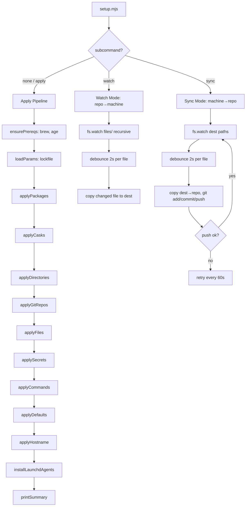

# Design Document: zx-dotfiles

## Overview

Replace the dacha framework (Deno-based, class hierarchies, dependency graphs) with a single flat `setup.mjs` zx script. The script manages the full MacBook Pro system configuration: brew packages, cask apps, config files, age-encrypted secrets, git repos, directories, shell commands, macOS defaults, and a params lockfile. It supports three modes: default apply, `watch` (repo→machine), and `sync` (machine→repo).

The design philosophy is radical simplicity: plain arrays of data objects at the top of the file, flat helper functions, no classes, no dependency graph, no framework abstractions. Resources are processed sequentially in a hardcoded order that satisfies implicit dependencies (e.g., directories before git repos, fish package before fisher bootstrap).

zx provides `$` for shell commands, `fs` (Node's fs/promises), `path`, `os`, and `question()` for interactive prompts — all auto-imported.

## Architecture



The script is a single file with this top-to-bottom structure:

1. **Data declarations** — arrays of plain objects defining all resources
2. **Helper functions** — `resolveHome`, `fileHash`, `ensureBrew`, `ensureAge`, `loadParams`, etc.
3. **Apply functions** — one per resource type, each iterating its array with check→skip/apply→report
4. **Watch/Sync functions** — `watchRepoToMachine()`, `syncMachineToRepo()`
5. **Main entrypoint** — parses `argv`, dispatches to apply pipeline or watch/sync mode

### Execution Order (Apply)

The apply pipeline runs resource types in this fixed order to satisfy implicit dependencies:

1. Prerequisites (brew, age)
2. Params lockfile
3. Brew packages
4. Brew casks
5. Directories (including conditional `~/source/taxbit`)
6. Git repos (depend on `~/source` existing)
7. Config files (some depend on packages like fish being installed)
8. Secrets (depend on age being installed)
9. Shell commands (fisher depends on fish config files, krew depends on krew+kubectl packages)
10. macOS defaults
11. Hostname
12. Launchd agents (watch + sync daemons)

## Components and Interfaces

### Data Structures (Resource Definitions)

Each resource type is a plain array of objects at the top of the file:

```javascript
// Packages — just an array of names
const packages = ["cowsay", "coreutils", "curl", ...];

// Casks — just an array of names
const casks = ["alt-tab", "audacity", "battle-net", ...];

// Directories — array of paths (some conditional)
const directories = (params) => [
  "~/tmp", "~/source",
  ...(params.isTaxbitLaptop ? ["~/source/taxbit"] : []),
];

// Git repos — array of {repo, dest}
const gitRepos = [
  { repo: "eabrouwer3/advent-of-code", dest: "~/source/advent-of-code" },
  ...
];

// Files — array of {src, dest}
const files = [
  { src: "files/fish", dest: "~/.config/fish" },
  { src: "files/ghostty/config", dest: "~/.config/ghostty/config" },
  ...
];

// Secrets — array of {src, dest}
const secrets = [
  { src: "secrets/node-auth-token.age", dest: "~/.config/dotfiles/secrets/node-auth-token" },
  ...
];

// Commands — array of {id, run, check?}
const commands = [
  { id: "fisher-bootstrap", run: "fish -c '...'", check: "fish -c 'functions -q fisher'" },
  { id: "krew-plugins", run: "...", check: "..." },
];

// macOS defaults — array of {domain, key, value}
const defaults = [
  { domain: "com.apple.finder", key: "AppleShowAllFiles", value: true },
  ...
];
```

### Helper Functions

```
resolveHome(p: string) → string
```
Expands `~/` to `os.homedir()`.

```
fileHash(filepath: string) → string | null
```
Returns SHA-256 hex digest of a file, or `null` if the file doesn't exist. Uses Node's `crypto.createHash`.

```
ensureBrew() → void
```
Checks `which brew`, installs Homebrew via official script if missing.

```
ensureAge() → void
```
Checks `which age`, runs `brew install age` if missing.

```
loadParams(lockfilePath: string) → {isTaxbitLaptop: boolean}
```
Reads lockfile if it exists, otherwise prompts via `question()`, writes lockfile, returns params.

```
defaultsTypeFlag(value) → string
```
Maps JS type to `defaults` CLI flag: `boolean→-bool`, `integer→-int`, `float→-float`, `string→-string`.

```
normalizeDefaultsRead(raw: string, desired) → string|number|boolean
```
Parses `defaults read` output to match the JS type of the desired value for comparison.

### Apply Functions

Each apply function follows the same pattern:

```
async function applyPackages(packages: string[]) → {applied: string[], skipped: string[], failed: string[]}
```

Pattern for each resource in the array:
1. **Check** — is the current state already correct?
2. **Skip** — if yes, add to `skipped`, continue
3. **Apply** — if no, run the mutation, add to `applied` or `failed`
4. **Report** — log each action with a status icon (✓ skip, ✚ apply, ✗ fail)

Individual apply functions:
- `applyPackages(packages)` — `brew list <pkg>` to check, `brew install <pkg>` to apply
- `applyCasks(casks)` — `brew list --cask <cask>` to check, `brew install --cask <cask>` to apply
- `applyDirectories(dirs)` — `fs.stat` to check, `fs.mkdir` recursive to apply
- `applyGitRepos(repos)` — check `.git` dir exists, `git clone` to apply
- `applyFiles(files)` — SHA-256 hash comparison for files, existence check for dirs, `fs.cp` to apply
- `applySecrets(secrets)` — `fs.stat` dest to check, `age -d -i ~/.ssh/id_rsa` to apply, `chmod 0600`
- `applyCommands(commands)` — run `check` command (exit 0 = skip), run `run` command to apply
- `applyDefaults(defaults)` — `defaults read` + normalize to check, `defaults write` to apply
- `applyHostname()` — `scutil --get ComputerName` to check, `scutil --set` to apply

### Watch Mode (repo→machine)

```
async function watchRepoToMachine(files) → void
```

Uses `fs.watch("files/", { recursive: true })` to watch the source directory. On change events, debounces per-file with a 2-second `setTimeout`. When the debounce fires, looks up the changed source path in the files array, copies to the corresponding destination.

### Sync Mode (machine→repo)

```
async function syncMachineToRepo(files) → void
```

Uses `fs.watch` on each resolved destination path. On change, debounces 2s, then:
1. Copies dest → corresponding source in repo
2. `git add <source>`
3. `git commit -m "auto-sync: update <filename>"`
4. `git push`
5. On push failure, queues for retry every 60s via `setInterval`

### Launchd Daemon Integration

The apply pipeline installs two macOS launchd agents so the watch and sync modes start automatically on login:

```
async function installLaunchdAgents(repoDir: string) → void
```

Generates and writes two plist files:
- `~/Library/LaunchAgents/dev.dotfiles.watch.plist` — runs `setup.mjs watch`
- `~/Library/LaunchAgents/dev.dotfiles.sync.plist` — runs `setup.mjs sync`

Each plist uses `KeepAlive: true` so macOS restarts the process if it crashes. Logs go to `~/Library/Logs/dotfiles-watch.log` and `~/Library/Logs/dotfiles-sync.log`.

The `ProgramArguments` point to the Node.js binary and the script path:
```xml
<array>
  <string>/path/to/node</string>
  <string>/path/to/repo/node_modules/.bin/zx</string>
  <string>/path/to/repo/setup.mjs</string>
  <string>watch</string>
</array>
```

The function:
1. Generates the plist XML content
2. Reads the existing plist (if any) and compares content
3. If content matches, skips (idempotent)
4. If different or missing, writes the plist and runs `launchctl unload` then `launchctl load`

This runs as step 12 in the apply pipeline, after hostname setup.

### Summary Reporter

```
function printSummary(results: {applied, skipped, failed}[]) → void
```

Aggregates all apply function results and prints a final summary: N applied, N skipped, N failed.

## Data Models

### Params Lockfile (`~/.config/dotfiles/params.lock.json`)

```json
{
  "version": 1,
  "createdAt": "2025-01-15T10:30:00.000Z",
  "params": {
    "isTaxbitLaptop": false
  }
}
```

Same schema as the existing dacha lockfile for backward compatibility.

### Resource Definition Shapes

```typescript
// Package / Cask — just a string name
type PackageName = string;

// Directory
type DirDef = string; // path with ~/

// Git repo
interface RepoDef {
  repo: string;   // "owner/name" format
  dest: string;   // destination path with ~/
}

// File mapping
interface FileDef {
  src: string;    // relative to repo root (e.g., "files/fish")
  dest: string;   // absolute path with ~/ (e.g., "~/.config/fish")
}

// Secret
interface SecretDef {
  src: string;    // relative to repo root (e.g., "secrets/node-auth-token.age")
  dest: string;   // absolute path with ~/
}

// Shell command
interface CommandDef {
  id: string;     // human-readable identifier
  run: string;    // shell command to execute
  check?: string; // shell command that returns 0 if already applied
}

// macOS default
interface DefaultDef {
  domain: string;
  key: string;
  value: string | number | boolean;
}
```

### Apply Result

Each apply function returns a simple result object:

```typescript
interface ApplyResult {
  applied: string[];  // resource IDs that were applied
  skipped: string[];  // resource IDs that were already correct
  failed: string[];   // resource IDs that failed
}
```


## Correctness Properties

*A property is a characteristic or behavior that should hold true across all valid executions of a system — essentially, a formal statement about what the system should do. Properties serve as the bridge between human-readable specifications and machine-verifiable correctness guarantees.*

### Property 1: Path resolution with home expansion

*For any* path string starting with `~/` and any home directory value, `resolveHome(path)` should return a string where `~/` is replaced with the home directory, and for any path not starting with `~/`, the path should be returned unchanged.

**Validates: Requirements 1.4**

### Property 2: Lockfile round trip

*For any* valid params object (with boolean and string values), writing the params to a lockfile via `writeLockFile` and then reading it back via `readLockFile` should produce an equivalent params object. The written JSON must always contain `version` (equal to 1), `createdAt` (a non-empty string), and `params` fields.

**Validates: Requirements 3.1, 3.2, 3.3**

### Property 3: File hash determinism and equality

*For any* byte sequence, computing `fileHash` twice on the same content should produce the same SHA-256 hex string. For any two distinct byte sequences (where the content differs), `fileHash` should produce different hex strings.

**Validates: Requirements 8.1, 8.2**

### Property 4: macOS defaults type inference

*For any* boolean value, `defaultsTypeFlag` should return `-bool`. For any integer, it should return `-int`. For any non-integer number, it should return `-float`. For any string, it should return `-string`. Additionally, for any value, `normalizeDefaultsRead(formatForDefaults(value), value)` should produce a value equal to the original.

**Validates: Requirements 11.1, 11.2**

### Property 5: Debounce coalesces rapid events

*For any* sequence of N events (N ≥ 1) arriving within the debounce window for the same key, the debounce function should fire the callback exactly once, after the delay has elapsed since the last event.

**Validates: Requirements 13.3, 14.4**

### Property 6: Summary aggregation

*For any* list of `ApplyResult` objects (each with applied, skipped, and failed arrays), the summary aggregation should report totals equal to the sum of each category across all results, with no items lost or duplicated.

**Validates: Requirements 12.4**

## Error Handling

### Prerequisite Failures
- If Homebrew installation fails, the script exits with a clear error message and non-zero exit code. No further resources are applied.
- If age installation fails, the script logs the error and skips all secret resources, but continues with other resource types.

### Individual Resource Failures
- Each apply function catches errors per-resource and records them in the `failed` array.
- A failed resource does not halt the pipeline — other resources of the same type and subsequent types continue.
- The exception: if `ensureBrew()` or `ensureAge()` fails, those are prerequisite failures that block dependent resource types.

### File Operations
- Missing source files are logged as failures and skipped.
- Permission errors during copy are caught and reported.
- Parent directory creation uses `{ recursive: true }` so missing intermediaries are handled.

### Shell Command Failures
- Commands that return non-zero exit codes are recorded as failed.
- stderr output is captured and included in the failure report.

### Watch/Sync Mode Errors
- File watcher errors are logged but don't crash the process.
- Git push failures in sync mode are queued for retry every 60 seconds.
- The retry queue is bounded implicitly (one entry per watched file path).

### Lockfile Errors
- If the lockfile is corrupted (invalid JSON), the script treats it as missing and re-prompts.
- Lockfile writes use a write-to-temp-then-rename pattern to avoid partial writes.

## Testing Strategy

### Dual Testing Approach

This project uses both unit tests and property-based tests:

- **Unit tests**: Verify specific examples, edge cases, and integration points (e.g., "the packages array contains exactly the expected 27 packages")
- **Property tests**: Verify universal properties across randomly generated inputs (e.g., "for any byte content, fileHash is deterministic")

### Property-Based Testing Configuration

- Library: `fast-check` (already available in the repo's deno.json dependencies)
- Each property test runs a minimum of 100 iterations
- Each property test is tagged with a comment referencing the design property:
  - Format: `Feature: zx-dotfiles, Property {number}: {property_text}`
- Each correctness property is implemented by a single property-based test

### Test Organization

Tests live alongside the script or in a `__tests__/` directory. The pure helper functions (`resolveHome`, `fileHash`, `defaultsTypeFlag`, `normalizeDefaultsRead`, `writeLockFile`, `readLockFile`, debounce logic) are extracted or importable for testing.

### Unit Tests Cover

- Data completeness: packages, casks, files, secrets, git repos, defaults arrays contain exactly the expected entries (Requirements 4.3, 5.3, 7.3, 8.5, 9.5, 11.3)
- Prerequisite skip behavior: ensureBrew/ensureAge skip when already present (Requirements 2.3, 2.4)
- Conditional directory creation: isTaxbitLaptop flag controls ~/source/taxbit (Requirements 3.4, 6.2)
- Push retry queuing: failed pushes are retried (Requirement 14.5)

### Property Tests Cover

- Property 1: `resolveHome` path expansion — Feature: zx-dotfiles, Property 1: Path resolution with home expansion
- Property 2: Lockfile write/read round trip — Feature: zx-dotfiles, Property 2: Lockfile round trip
- Property 3: `fileHash` determinism — Feature: zx-dotfiles, Property 3: File hash determinism and equality
- Property 4: `defaultsTypeFlag` + `normalizeDefaultsRead` — Feature: zx-dotfiles, Property 4: macOS defaults type inference
- Property 5: Debounce coalescing — Feature: zx-dotfiles, Property 5: Debounce coalesces rapid events
- Property 6: Summary aggregation — Feature: zx-dotfiles, Property 6: Summary aggregation
